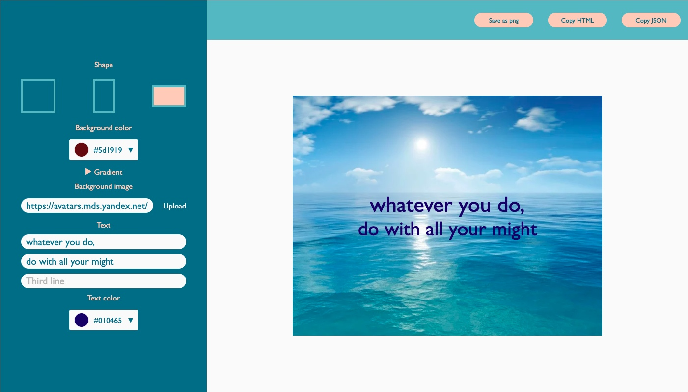

# create-banner
## Desktop banner maker app

## Launch
1. git clone https://github.com/elinaa21/create-banner.git
2. npm i
3. check localhost:3999 

at this moment functionality is supported only by newer versions of browsers
